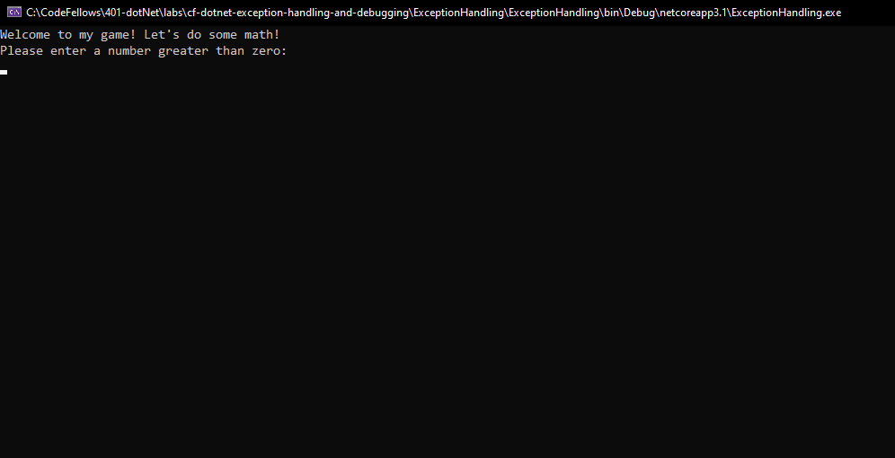
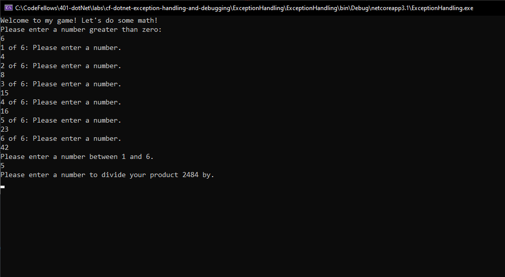
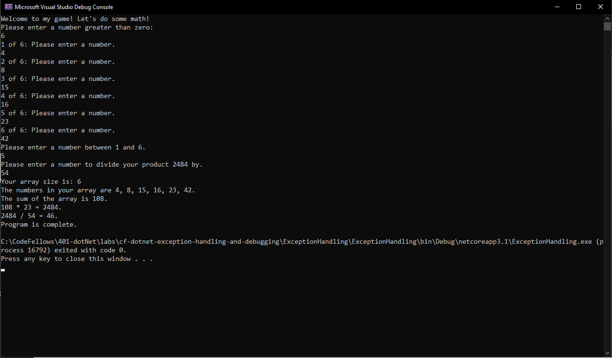

# Exception Handling & Debugging
Code Fellows 401 .NET - Lab 01  
_Author: [Robert James Nielsen](https://github.com/robertjnielsen)_

## Overview
The purpose of this lab is to create a .NET Core console application math game that takes user input, and utilizes error handling by following a given set of specifications within the lab instructions.

## Getting Started

### Clone This Repo
To clone this repository, enter the following in your command prompt:  
`$ git clone https://github.com/robertjnielsen/cf-dotnet-exception-handling-and-debugging.git`

### Run The Program From Visual Studio
Select `File` -> `Open` -> `Project / Solution`

Navigate to the location where you cloned the repository.

Double click on the `cf-dotnet-exception-handling-and-debugging` directory.

Then select and open `ExceptionHandling.sln`

## Visuals

##### Application Start

##### Application Running

##### Application Finished

## Change Log

**1.2** - 20200317
- Included screen captures of application in README.

**1.1** - 20200317
- Updated application with exception handling as per specifications provided in lab instructions.

**1.0** - 20200317
- Initial respository creation.
- Created initial program from specifications provided.

## License
This application is licensed under the [GNU GPL-3.0 License](https://www.gnu.org/licenses/gpl-3.0.en.html).

This product may be modified, reproduced or redistributed as you see fit.

This product comes **as-is**, and does not contain any warranty.

The author(s) are not liable for anything that may occur during use of misuse of this product. 